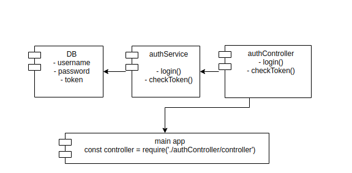

# Hardcoded dependency
### General infomation
```
This is a demo project about hardcoded dependency
```
### Overview Architecture


### Structure files
```bash
.
├── authController
│   └── controller.js
├── authService
│   └── service.js
├── DB
│   └── db.js
├── index.js
├── package.json
└── test
    └── service.test.js

```
